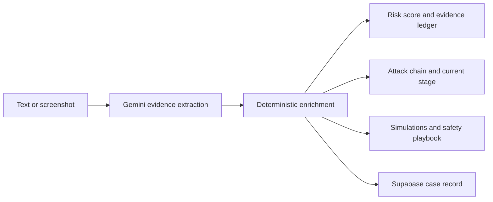

# Sentinel AI

Sentinel AI is a multimodal scam-investigation system for suspicious messages and screenshots. It combines Gemini evidence extraction with transparent deterministic safety logic so a person can understand the risk, their current exposure, and what to do next.

## Highlights

- **Evidence fusion risk engine:** keeps Gemini confidence separate from a bounded, explainable risk score.
- **Scam-chain reconstruction:** separates confirmed evidence, possible impersonation, and predicted downstream harm.
- **Counterfactual safety simulator:** shows the exposure effect of clicking, credential entry, OTP sharing, payments, and stopping.
- **Stage-aware safety playbook:** gives immediate actions that change when a user reports exposure.
- **Multimodal analysis:** text and screenshots return the same structured investigation report.



## Quick start

```powershell
uv sync
Copy-Item .env.example .env
uv run uvicorn backend.api.main:app --reload
uv run streamlit run frontend/streamlit_app.py
```

Set these values in `.env`:

```text
GEMINI_API_KEY=
SUPABASE_URL=
SUPABASE_SECRET_KEY=
```

Never commit `.env` or service keys.

## Interpreting risk

`risk_score` is a safety index from 0 to 100, not a probability that fraud occurred. It starts with Gemini's assessment, then applies visible deterministic rules and explicitly reported user actions. The response includes every applied factor so the score can be audited.

Evidence increments are capped at 35 to avoid double-counting related signals. `confidence` remains Gemini's separate confidence in its analysis.

| Signal | Maximum risk increment |
| --- | ---: |
| Urgency or coercion | 6 |
| Secrecy | 8 |
| Credential, payment, or identity request | 12 each |
| Shortened URL | 8 |
| Known brand/domain mismatch | 18 |
| User clicked link | 10 |
| Credentials or identity shared | 25 each |
| OTP shared or money sent | 30 each |

At 100, the score is capped. Simulations therefore show each action's additional **exposure impact** even when the displayed risk remains 100.

## Safety semantics

The attack chain uses four labels:

- `confirmed`: directly observed evidence or a user-reported action
- `possible`: supported inference, such as brand impersonation
- `predicted`: plausible next step that has not happened
- `prevented`: supported evidence that an anticipated step was stopped

Sentinel never assumes a user clicked, paid, or disclosed information from the message alone. `current_stage` stays `unknown` until the user answers the safety questions. An explicit `No` to every action sets `before_interaction`.

## API

| Method | Endpoint | Purpose |
| --- | --- | --- |
| `POST` | `/api/investigations` | Analyze pasted text and create a case |
| `POST` | `/api/investigations/image` | Analyze a PNG, JPEG, or WEBP screenshot |
| `GET` | `/api/investigations` | List recent cases |
| `GET` | `/api/investigations/{id}` | Retrieve a case |
| `POST` | `/api/investigations/{id}/follow-up` | Update reported exposure |

Use stable action keys for follow-up answers:

```json
{
  "answers": {
    "link_clicked": "No",
    "credentials_entered": "No",
    "otp_shared": "Not sure",
    "money_sent": "No",
    "identity_shared": "No"
  }
}
```

Screenshot files are held temporarily and deleted after Gemini Vision reads them. If Supabase is unavailable, image analysis still returns its result with `persistence_status: "unavailable"`; that transient result cannot accept saved follow-ups.

## Architecture

```text
backend/api                 FastAPI routes and request validation
backend/services            Workflow coordination and resilience
backend/repositories        Supabase persistence boundary
backend/investigation       Gemini, risk, chain, simulations, enrichment
frontend/streamlit_app.py   Investigation interface
```

Existing Qdrant and Inngest document workflows remain independent from the investigation request path.

## Tests

```powershell
uv run python -m unittest discover -v
```

The suite covers safe messages, PayPal-style smishing, fake jobs, score bounds, domain handling, stages, simulations, follow-up persistence, image cleanup/fallback, API contracts, and Streamlit rendering.

For a live Gemini smoke check:

```powershell
uv run python -m backend.investigation.test_vision
```

The service smoke test writes a real Supabase record, so run it only with a working test database:

```powershell
uv run python -m backend.services.test_investigation_service
```
